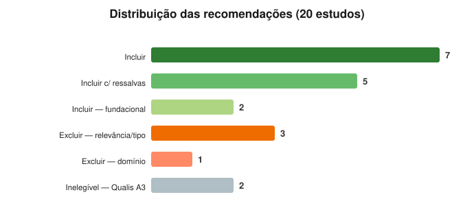

# RSL — Agentic AI Copilot para Resposta a Incidentes

Repositório da **Revisão Sistemática da Literatura (RSL)** do Trabalho II (PPGCA · Unisinos), seguindo as diretrizes de **Kitchenham et al. (2009)** e a lógica **DARE (QA1–QA4)**. Reúne os estudos candidatos **P20–P40**, os prompts de avaliação, os pareceres do revisor e a síntese dos resultados (dados, gráficos e relatório).

> ⚠️ **Repositório privado.** Contém PDFs de artigos com direitos autorais (IEEE, Elsevier, Springer, MDPI, Wiley, etc.) em `docs/`, mantidos apenas para a avaliação acadêmica.
>
> ✅ **Pendência transversal (RESOLVIDA):** Citações, SJR e Qualis **não são verificáveis nos PDFs** — durante a avaliação os valores vieram dos insumos e foram marcados `[VERIFICAR]`. A verificação externa foi concluída e consolidada em [`papers.csv`](papers.csv): **Qualis (2025-2028), percentil Scopus, SJR quartile, DOI, ISSN, ano e contagem de citações em três fontes (OpenAlex, Crossref, Scopus; 2026-07-27)** dos 39 estudos (P01–P40) — confirmando a inelegibilidade de P39/P40 (Qualis A3) e o critério **Citações ≥ 1** para todos os incluídos (única exceção: P35, com 0 citações, coberto pela `RECENCY_EXCEPTION` de publicação < 12 meses).

## 🚀 Comece por aqui

| Quero…                     | Abra                                                                                           |
| -------------------------- | ---------------------------------------------------------------------------------------------- |
| Uma visão geral interativa | 📊 **[Dashboard de resultados](reviews/DASHBOARD.md)**                                         |
| A análise completa         | 📄 [Relatório de síntese](reviews/relatorio-sintese.md) · [PDF](reviews/relatorio-sintese.pdf) |
| Os dados crus              | 🧮 [Resultados consolidados (CSV)](reviews/resultados-consolidados.csv)                        |
| Os gráficos                | 🖼️ [Galeria](reviews/graficos.md) · [como criá-los](reviews/COMO-CRIAR-GRAFICOS.md)            |
| Um estudo específico       | 📚 [Índice de pareceres](reviews/README.md) ou a tabela abaixo                                 |
| As fichas de extração      | 📑 [Índice das fichas P01–P40](report/README.md)                                               |
| A extração PICOC           | 🧩 [Tabela consolidada P01–P40](picoc/picoc-results-consolidated-P01-P40-Claude.md)            |
| O fluxo de seleção         | 🔀 [Diagrama PRISMA](reviews/PRISMA.md)                                                        |

## 📈 Resultado em um relance

20 estudos · **18 avaliados** + **2 inelegíveis** (Qualis A3) · **14 Incluir** · **4 Excluir** · SCORE_RQ médio **3,83** · SCORE_QA médio **3,50** · **14 em Banda Alta** · lacuna sistemática em **RQ4 (Ética & Desafios)**.



## 🗂️ Índice de estudos (P20–P40)

> P36 era duplicata de P31/LEMAD e foi removido do corpus.

| ID  | Estudo                           | Parecer                          | Prompt                          | PDF                                                                                                                                                                       | Recom.                                |
| --- | -------------------------------- | -------------------------------- | ------------------------------- | ------------------------------------------------------------------------------------------------------------------------------------------------------------------------- | ------------------------------------- |
| P20 | LLM Agentic Workflow (IaC)       | [parecer](reviews/review-P20.md) | [prompt](prompts/prompt-P20.md) | [PDF](docs/P20-A1-LLM_Agentic_Workflow_for_Automated_Vulnerability_Detection_and_Remediation_in_Infrastructure-as-Code.pdf)                                               | ✅ Incluir c/ ressalvas               |
| P21 | SLM Agent for ICT Ops            | [parecer](reviews/review-P21.md) | [prompt](prompts/prompt-P21.md) | [PDF](docs/P21-A1-Small_Language_Model_Agent_for_the_Operations_of_Continuously_Updating_ICT_Systems.pdf)                                                                 | ✅ Incluir                            |
| P22 | ARM — Autonomous Remediation     | [parecer](reviews/review-P22.md) | [prompt](prompts/prompt-P22.md) | [PDF](docs/P22-A1-ARM_Autonomous_Remediation_and_Management_With_LLM_Agents_for_Intent-Driven_Control.pdf)                                                                | ✅ Incluir                            |
| P23 | TAMO (RCA tool-assisted)         | [parecer](reviews/review-P23.md) | [prompt](prompts/prompt-P23.md) | [PDF](docs/P23-A1-TAMOFine-Grained_Root_Cause_Analysis_via_Tool-Assisted_LLM_Agent_With_Multi-Modality_Observation_Data_in_Cloud-Native_Systems.pdf)                      | ✅ Incluir c/ ressalvas               |
| P24 | AgentAI Survey                   | [parecer](reviews/review-P24.md) | [prompt](prompts/prompt-P24.md) | [PDF](docs/P24-A1-1-s2.0-S0957417425020238-main.pdf)                                                                                                                      | ✅ Incluir c/ ressalvas (fundacional) |
| P25 | AI-Driven MAS (cyber range)      | [parecer](reviews/review-P25.md) | [prompt](prompts/prompt-P25.md) | [PDF](docs/P25-A1-s41598-026-45937-9.pdf)                                                                                                                                 | ✅ Incluir                            |
| P26 | Surveying RCA Techniques         | [parecer](reviews/review-P26.md) | [prompt](prompts/prompt-P26.md) | [PDF](docs/P26-A1-Surveying_Root_Cause_Analysis_Techniques_A_Comprehensive_Review_of_Aspects_for_Multi-Service_Applications.pdf)                                          | ❌ Excluir (relevância/tipo)          |
| P27 | MA-RCA (multi-agente RCA)        | [parecer](reviews/review-P27.md) | [prompt](prompts/prompt-P27.md) | [PDF](docs/P27-A1-s40747-025-02096-0.pdf)                                                                                                                                 | ✅ Incluir                            |
| P28 | MAS Cybersecurity (LLM)          | [parecer](reviews/review-P28.md) | [prompt](prompts/prompt-P28.md) | [PDF](docs/P28-A1-A_Multi-Agent_System_for_Cybersecurity_Threat_Detection_and_Correlation_Using_Large_Language_Models.pdf)                                                | ✅ Incluir                            |
| P29 | AIOps Log Anomaly SLR            | [parecer](reviews/review-P29.md) | [prompt](prompts/prompt-P29.md) | [PDF](docs/P29-A2-1-s2.0-S2667305325001346-main.pdf)                                                                                                                      | ❌ Excluir (relevância/tipo)          |
| P30 | LLM Inference Engine RCA         | [parecer](reviews/review-P30.md) | [prompt](prompts/prompt-P30.md) | [PDF](docs/P30-A2-BDCC-10-00060-v2.pdf)                                                                                                                                   | ❌ Excluir (relevância/tipo)          |
| P31 | LEMAD (anomaly detection)        | [parecer](reviews/review-P31.md) | [prompt](prompts/prompt-P31.md) | [PDF](docs/P31-A2-electronics-14-03008.pdf)                                                                                                                               | ✅ Incluir                            |
| P32 | GALR (RCA + recovery)            | [parecer](reviews/review-P32.md) | [prompt](prompts/prompt-P32.md) | [PDF](docs/P32-A2-electronics-15-00243-v2.pdf)                                                                                                                            | ✅ Incluir c/ ressalvas               |
| P33 | Review of Agentic AI in Cyber    | [parecer](reviews/review-P33.md) | [prompt](prompts/prompt-P33.md) | [PDF](docs/P33-A2-64b5f019-bc3d-42da-870b-8f7434e7057c_f1000res169337.pdf)                                                                                                | ✅ Incluir c/ ressalvas (fundacional) |
| P34 | LLMs in IR management            | [parecer](reviews/review-P34.md) | [prompt](prompts/prompt-P34.md) | [PDF](docs/P34-A2-s10207-025-01144-7.pdf)                                                                                                                                 | ✅ Incluir c/ ressalvas               |
| P35 | Graph-Augmented Multi-Agent RCA  | [parecer](reviews/review-P35.md) | [prompt](prompts/prompt-P35.md) | [PDF](docs/P35-A2-TSP_CMC_77908.pdf)                                                                                                                                      | ✅ Incluir                            |
| P37 | AI Trust & Framework Readiness   | [parecer](reviews/review-P37.md) | [prompt](prompts/prompt-P37.md) | [PDF](docs/P37-A2-algorithms-19-00062-v2.pdf)                                                                                                                             | ✅ Incluir c/ ressalvas               |
| P38 | Multi-Agent vs RAG               | [parecer](reviews/review-P38.md) | [prompt](prompts/prompt-P38.md) | [PDF](docs/P38-A2-electronics-14-04883-v2.pdf)                                                                                                                            | ❌ Excluir (domínio)                  |
| P39 | Agentic AI & the Cyber Arms Race | [parecer](reviews/review-P39.md) | [prompt](prompts/prompt-P39.md) | [PDF](docs/P39-A3-Agentic_AI_and_the_Cyber_Arms_Race.pdf)                                                                                                                 | ❌ Excluir (Qualis A3)                |
| P40 | LLM-Based Network Mgmt Survey    | [parecer](reviews/review-P40.md) | [prompt](prompts/prompt-P40.md) | [PDF](docs/P40-A3-Int%20J%20Network%20Mgmt%20-%202025%20-%20Hong%20-%20A%20Comprehensive%20Survey%20on%20LLM%E2%80%90Based%20Network%20Management%20and%20Operations.pdf) | ❌ Excluir (Qualis A3)                |

## 📁 Estrutura do repositório

```
.
├── README.md                     ← este arquivo (índice geral)
├── prompt-template.md            ← template do prompt de avaliação (papel, RQs, QA, saída)
├── Artigos-TrabalhoII.csv        ← insumos: ID, artigo, arquivo, Qualis, SJR
├── papers.csv                    ← bibliometria VERIFICADA (P01–P40): DOI, Qualis 2025-2028, Scopus %, SJR, ISSN, ano
├── TrabalhoI/                    ← RSL fundacional (base do corpus e do prompt)
│   ├── README.md                ← índice do Trabalho I
│   ├── Artigo_Agentic_AI V3.pdf ← artigo da RSL original
│   ├── Artigo_Agentic_AI V3_Latex.zip ← fontes LaTeX do artigo
│   └── References/              ← 19 estudos incluídos (P1–P19)
├── research/                     ← Etapa 1: descoberta de candidatos
│   ├── README.md                ← índice da descoberta
│   ├── prompt.md                ← prompt de busca/triagem (EN)
│   ├── gemini-research-report.md  ← candidatos levantados pelo Gemini
│   ├── claude-research-report.md  ← candidatos levantados pelo Claude
│   └── chatgpt-research-report.md ← candidatos levantados pelo ChatGPT
├── prompts/                      ← 20 prompts preenchidos (prompt-P20..P40)
├── docs/                         ← 39 PDFs do corpus (P01–P19 fundacionais + P20–P40 avaliados)
├── report/                       ← Etapa 3: fichas de extração estruturada
│   ├── README.md                ← índice das fichas (P01–P40)
│   ├── paper-extraction-prompt-template.md ← template de extração (11 campos, Kitchenham)
│   ├── Pxx-extraction.csv       ← 39 fichas em inglês
│   ├── Pxx-extraction-ptBR.csv  ← 39 fichas em português (termos técnicos em EN)
│   └── consolidated-extraction[-ptBR].csv ← consolidados (uma linha por artigo)
├── picoc/                        ← Etapa 4: extração PICOC (delimitação de escopo)
│   ├── picoc-extraction-prompt.md ← prompt de extração PICOC (Kitchenham; Petticrew & Roberts)
│   └── picoc-results-consolidated-P01-P40-{Claude,ChatGPT,Gemini}.md ← tabelas consolidadas por avaliador
├── bookmark.md                   ← bookmarks de recursos externos (QUALIS etc.)
├── referencias.csv               ← referências citadas pelos artigos (extraídas via DOIS.py)
├── DOIS.py                       ← script de extração de referências (Crossref/OpenAlex/S2/COCI)
├── DOIS.txt                      ← lista de DOIs de entrada do DOIS.py
└── reviews/                      ← Etapa 2: avaliação e síntese
    ├── DASHBOARD.md              ← painel central (hub de tudo)
    ├── README.md                 ← índice/tabela-síntese dos pareceres
    ├── relatorio-sintese.md/.pdf ← análise agregada (com gráficos)
    ├── resultados-consolidados.csv ← matriz de escores (RQ/QA/banda/recomendação)
    ├── graficos.md               ← galeria dos gráficos
    ├── COMO-CRIAR-GRAFICOS.md     ← how-to de geração dos gráficos
    ├── review-P20..P40.md        ← 20 pareceres do revisor
    ├── charts/                   ← 5 gráficos SVG
    ├── scripts/                  ← geradores (gen_charts.py, build_pdf.py)
    └── ChatGPT/                  ← avaliações comparativas (P20–P40, sem P36)
```

## 📚 Documentos por categoria

### Base fundacional (Trabalho I)

- [`TrabalhoI/`](TrabalhoI/) — **RSL fundacional** do mestrado: o artigo (PDF + fontes LaTeX) e os **19 estudos incluídos (P1–P19)**. É o corpus corrente que serviu de **referência para construir o [prompt de busca](research/prompt.md)** da Etapa 1 e a base de deduplicação dos candidatos. Ver [`TrabalhoI/README.md`](TrabalhoI/README.md).

### Descoberta de candidatos (Etapa 1)

- [`research/`](research/) — **descoberta de artigos candidatos** para ampliar o corpus, executando o mesmo prompt de busca em **Gemini**, **Claude** e **ChatGPT**. Insumos exploratórios (Qualis/SJR/citações majoritariamente `UNVERIFIED`) que originaram os estudos P20–P40. Ver [`research/README.md`](research/README.md).

### Insumos (entrada)

- [`prompt-template.md`](prompt-template.md) — template do prompt (papel, contexto, RQ1–RQ5, QA1–QA4, formato de saída).
- [`Artigos-TrabalhoII.csv`](Artigos-TrabalhoII.csv) — metadados dos estudos (ID, arquivo, Qualis, SJR) usados como insumo na avaliação (valores então `[VERIFICAR]`).
- [`papers.csv`](papers.csv) — **bibliometria verificada** dos 39 estudos (P01–P40): DOI, veículo, **Qualis 2025-2028**, **percentil Scopus**, **SJR quartile**, ISSN, ano e **contagem de citações em três fontes** (OpenAlex, Crossref, Scopus — verificadas em 2026-07-27). Resolve integralmente a pendência transversal (Qualis/SJR/citações).
- [`reviews/PRISMA.md`](reviews/PRISMA.md) — **diagrama PRISMA 2020** (Mermaid) do fluxo de seleção: ≈51 identificados → 21 candidatos → 20 triados → 18 avaliados → **14 incluídos** → corpus final **33** (19 fundacionais + 14 novos), com critérios de inclusão (I1–I6) e exclusão (E1–E5) e verificação por artefato.
- [`prompts/`](prompts/) — 20 prompts preenchidos, um por estudo.
- [`docs/`](docs/) — **39 PDFs do corpus**: P01–P19 (estudos fundacionais do Trabalho I) + P20–P40 (candidatos avaliados). Índice completo com links em [`report/README.md`](report/README.md).
- [`DOIS.py`](DOIS.py) + [`DOIS.txt`](DOIS.txt) — script e lista de DOIs para extrair as referências citadas pelos artigos (Crossref, OpenAlex, Semantic Scholar, OpenCitations) → gera [`referencias.csv`](referencias.csv).

### Avaliação & síntese (saída)

- [`reviews/DASHBOARD.md`](reviews/DASHBOARD.md) — **painel central**.
- [`reviews/relatorio-sintese.md`](reviews/relatorio-sintese.md) / [`.pdf`](reviews/relatorio-sintese.pdf) — relatório de síntese.
- [`reviews/resultados-consolidados.csv`](reviews/resultados-consolidados.csv) — dados consolidados.
- [`reviews/README.md`](reviews/README.md) — índice dos pareceres.
- [`reviews/graficos.md`](reviews/graficos.md) — galeria · [`reviews/charts/`](reviews/charts/) — SVGs.
- [`reviews/review-P20.md` … `review-P40.md`](reviews/) — 20 pareceres.

### Extração de dados (Etapa 3)

- [`report/`](report/) — **fichas de extração estruturada** dos 39 artigos (metodologia Kitchenham, 11 campos com foco em MTTD/MTTR e Agentic AI). Uma ficha por artigo em inglês (`Pxx-extraction.csv`) e português (`Pxx-extraction-ptBR.csv`), mais os consolidados [`consolidated-extraction.csv`](report/consolidated-extraction.csv) / [`-ptBR`](report/consolidated-extraction-ptBR.csv). Template em [`report/paper-extraction-prompt-template.md`](report/paper-extraction-prompt-template.md). Ver [`report/README.md`](report/README.md).

### Extração PICOC (Etapa 4)

- [`picoc/picoc-extraction-prompt.md`](picoc/picoc-extraction-prompt.md) — prompt de extração **PICOC** (Population, Intervention, Comparison, Outcomes, Context) sobre os 39 PDFs, com regras antifabricação (`NÃO DECLARADO` / `N/A`) e âncoras de evidência. **v1.1.0**: Comparison = DECLARED somente com baseline empírico (contraste conceitual → `N/A`).
- [`picoc/picoc-results-consolidated-P01-P40-Claude.md`](picoc/picoc-results-consolidated-P01-P40-Claude.md) — **tabela PICOC consolidada** (39 artigos) com síntese transversal e raciocínio por artigo; achado central: nenhum estudo mede MTTD/MTTR nominalmente.
- [`picoc/picoc-results-consolidated-P01-P40-ChatGPT.md`](picoc/picoc-results-consolidated-P01-P40-ChatGPT.md) · [`-Gemini-Atualizado.md`](picoc/picoc-results-consolidated-P01-P40-Gemini-Atualizado.md) — execuções paralelas do mesmo prompt em ChatGPT e Gemini, para comparação entre avaliadores. _(A [versão original do Gemini](picoc/picoc-results-consolidated-P01-P40-Gemini.md) não cobria P01–P09 e é mantida como registro histórico.)_
- [`picoc/picoc-comparacao-avaliadores.md`](picoc/picoc-comparacao-avaliadores.md) — **comparação Claude × ChatGPT × Gemini** da extração PICOC sobre os 39 artigos (acordo 100% em 4 elementos; Comparison 79%, Fleiss κ = 0,37 — divergência definicional sobre contraste conceitual em estudos secundários). Os 12 casos divergentes foram **reclassificados pela regra v1.1.0** (resultado final: 26 DECLARED · 13 N/A, coluna `Comparison_Final_Protocolo`) · dados em [`picoc/picoc-comparacao-avaliadores.csv`](picoc/picoc-comparacao-avaliadores.csv).
- [`picoc/picoc-search-string.md`](picoc/picoc-search-string.md) — **string de busca da RSL** derivada da síntese PICOC (blocos Intervention × Context; Outcomes só como refinamento opcional), **calibrada contra o corpus** e **validada em execução real na OpenAlex e no Scopus** (Scopus Search API, por DOI): recall **13/14 dos estudos incluídos nas três validações** (única perda: P24, trade-off documentado); excluídos/inelegíveis não recuperados (comportamento desejável); volume no Scopus **12.783** (2020+, EN) vs. ≈ 49,7 mil na OpenAlex. Sintaxes para Scopus, WoS, IEEE Xplore e ACM DL. Nota: P01 não é indexado pelo Scopus.

### Ferramentas

- [`reviews/scripts/`](reviews/scripts/) — geradores ([`gen_charts.py`](reviews/scripts/gen_charts.py), [`build_pdf.py`](reviews/scripts/build_pdf.py)) + [README](reviews/scripts/README.md).
- [`reviews/COMO-CRIAR-GRAFICOS.md`](reviews/COMO-CRIAR-GRAFICOS.md) — how-to dos gráficos.

### Comparação

- [`reviews/ChatGPT/`](reviews/ChatGPT/) — avaliações paralelas dos 20 estudos (P20–P40, sem P36) com ChatGPT, para comparação entre avaliadores; índice por estudo em [`reviews/README.md`](reviews/README.md#avaliações-comparativas-chatgpt). _(Conjunto separado dos pareceres oficiais `review-Pxx.md`.)_
- [`reviews/comparacao-avaliadores.md`](reviews/comparacao-avaliadores.md) — **comparação Claude × ChatGPT** (concordância de decisão 90%, κ = 0,74) · dados em [`reviews/comparacao-avaliadores.csv`](reviews/comparacao-avaliadores.csv).

## 🔁 Reproduzir

```bash
python3 reviews/scripts/gen_charts.py   # CSV → gráficos SVG
python3 reviews/scripts/build_pdf.py    # relatório + SVGs → PDF
```

Detalhes em [`reviews/scripts/README.md`](reviews/scripts/README.md) e [`reviews/COMO-CRIAR-GRAFICOS.md`](reviews/COMO-CRIAR-GRAFICOS.md).

## 🧭 Metodologia (resumo)

**Etapa 1 — Descoberta:** a partir da [RSL fundacional (Trabalho I)](TrabalhoI/README.md) — artigo + 19 estudos P1–P19 —, o [prompt de busca](research/prompt.md) é executado em três assistentes (Gemini, Claude, ChatGPT) para levantar candidatos que estendam esse corpus; os resultados ficam em [`research/`](research/) e, após triagem e verificação, originam os estudos P20–P40.

**Etapa 2 — Avaliação:** para cada estudo: o [template](prompt-template.md) é preenchido com os insumos → o prompt é executado contra o PDF → o revisor produz **3 tabelas** (Bibliométrica, Classificação das RQs, Avaliação de Qualidade) e um **parecer** (Incluir / Incluir com ressalvas / Excluir). Os escores alimentam o [CSV consolidado](reviews/resultados-consolidados.csv), que origina os [gráficos](reviews/graficos.md) e o [relatório de síntese](reviews/relatorio-sintese.md).
