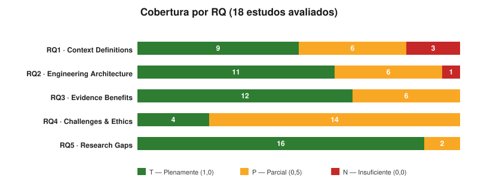
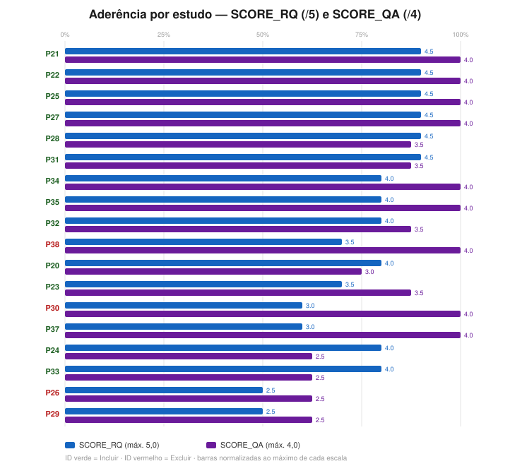
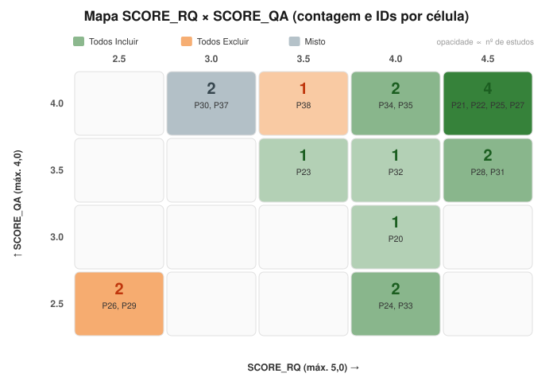
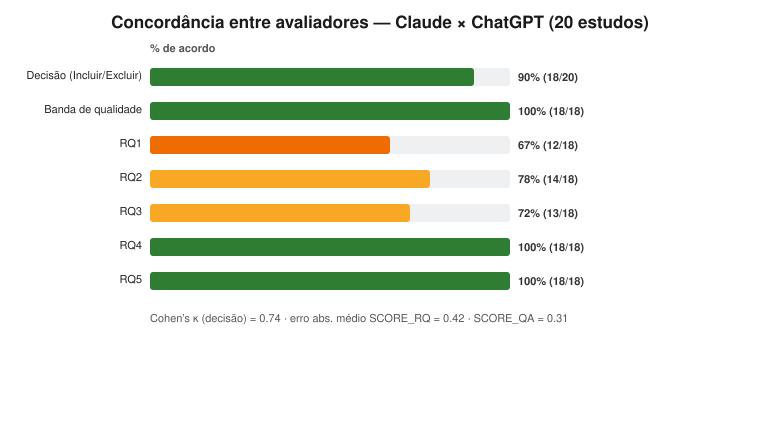

# 📊 Dashboard de Resultados — RSL "Agentic AI Copilot para Resposta a Incidentes"

Painel central que reúne **todos os artefatos** da avaliação dos estudos candidatos **P20–P40** (20 estudos; P36 era duplicata de P31/LEMAD, removida).

## 🔗 Navegação rápida

| Artefato                                                                                     | Descrição                                                                                                                                         |
| -------------------------------------------------------------------------------------------- | ------------------------------------------------------------------------------------------------------------------------------------------------- |
| 📄 [Relatório de síntese (MD)](relatorio-sintese.md) · [PDF](relatorio-sintese.pdf)          | Análise agregada: funil, cobertura por RQ, qualidade, ranking, achados                                                                            |
| 🧮 [Resultados consolidados (CSV)](resultados-consolidados.csv)                              | Matriz machine-readable: RQ1-5, QA1-4, escores, banda, recomendação                                                                               |
| 🖼️ [Galeria de gráficos](graficos.md)                                                        | Os 5 gráficos com leitura                                                                                                                         |
| 📚 [Índice de pareceres](README.md)                                                          | Tabela-síntese por estudo                                                                                                                         |
| 📐 [Comparação entre avaliadores](comparacao-avaliadores.md)                                 | Claude × ChatGPT: concordância (decisão 90%, κ = 0,74)                                                                                            |
| 🛠️ [Scripts geradores](scripts/README.md) · [Como criar os gráficos](COMO-CRIAR-GRAFICOS.md) | Regeneração de gráficos e PDF                                                                                                                     |
| 🔁 [Citações cruzadas no corpus](../citacoes-cruzadas.md)                                    | Quem cita quem entre P01–P40 (OpenAlex × Crossref × Scopus)                                                                                       |
| 📥 Fontes                                                                                    | [Prompts](../prompts/) · [PDFs dos artigos](../docs/) · [Template do prompt](../prompt-template.md) · [CSV de insumos](../Artigos-TrabalhoII.csv) |

## 📈 Números-chave

| Métrica                               |                                               Valor |
| ------------------------------------- | --------------------------------------------------: |
| Estudos processados                   |                                              **20** |
| Avaliados integralmente               |                                              **18** |
| Inelegíveis na triagem (Qualis A3)    |                                    **2** (P39, P40) |
| **Incluir**                           | **14** (7 plenos · 5 c/ ressalvas · 2 fundacionais) |
| **Excluir** (relevância/tipo/domínio) |                          **4** (P26, P29, P30, P38) |
| SCORE_RQ médio (mediana)              |                                      **3,83** (4,0) |
| SCORE_QA médio (mediana)              |                                     **3,50** (3,75) |
| Banda Alta / Média / Baixa            |                                      **14 / 4 / 0** |
| Lacuna sistemática                    |         **RQ4 (Ética & Desafios)** — só 4/18 plenas |

## 🗂️ Estudos avaliados (parecer · escores · recomendação)

> Clique no **ID** para abrir o parecer completo. Fontes: [prompt](../prompts/) · [PDF](../docs/).

| ID                   | Estudo                             | Veículo               | SCORE_RQ | SCORE_QA | Banda | Recomendação                 |
| -------------------- | ---------------------------------- | --------------------- | :------: | :------: | ----- | ---------------------------- |
| [P20](review-P20.md) | LLM Agentic Workflow (IaC)         | IEEE Access           |   4.0    |   3.0    | Alta  | Incluir c/ ressalvas         |
| [P21](review-P21.md) | SLM Agent for ICT Ops              | IEEE Access           |   4.5    |   4.0    | Alta  | **Incluir**                  |
| [P22](review-P22.md) | ARM — Autonomous Remediation       | IEEE IoT Journal      |   4.5    |   4.0    | Alta  | **Incluir**                  |
| [P23](review-P23.md) | TAMO (RCA tool-assisted)           | IEEE TSC              |   3.5    |   3.5    | Alta  | Incluir c/ ressalvas         |
| [P24](review-P24.md) | AgentAI Survey                     | Elsevier ESWA         |   4.0    |   2.5    | Média | Incluir c/ ressalvas (fund.) |
| [P25](review-P25.md) | AI-Driven MAS (cyber range)        | Scientific Reports    |   4.5    |   4.0    | Alta  | **Incluir**                  |
| [P26](review-P26.md) | Surveying RCA Techniques           | IEEE TSC              |   2.5    |   2.5    | Média | Excluir                      |
| [P27](review-P27.md) | MA-RCA (multi-agente RCA)          | Complex & Intel. Sys. |   4.5    |   4.0    | Alta  | **Incluir**                  |
| [P28](review-P28.md) | MAS Cybersecurity (LLM)            | IEEE Access           |   4.5    |   3.5    | Alta  | **Incluir**                  |
| [P29](review-P29.md) | AIOps Log Anomaly SLR              | Elsevier ISwA         |   2.5    |   2.5    | Média | Excluir                      |
| [P30](review-P30.md) | LLM Inference Engine RCA           | MDPI BDCC             |   3.0    |   4.0    | Alta  | Excluir                      |
| [P31](review-P31.md) | LEMAD (anomaly detection)          | MDPI Electronics      |   4.5    |   3.5    | Alta  | **Incluir**                  |
| [P32](review-P32.md) | GALR (RCA + recovery)              | MDPI Electronics      |   4.0    |   3.5    | Alta  | Incluir c/ ressalvas         |
| [P33](review-P33.md) | Review of Agentic AI in Cyber      | F1000Research         |   4.0    |   2.5    | Média | Incluir c/ ressalvas (fund.) |
| [P34](review-P34.md) | LLMs in IR management              | Springer IJIS         |   4.0    |   4.0    | Alta  | Incluir c/ ressalvas         |
| [P35](review-P35.md) | Graph-Augmented Multi-Agent RCA    | CMC / Tech Sci. Press |   4.0    |   4.0    | Alta  | **Incluir**                  |
| [P37](review-P37.md) | AI Trust & Framework Readiness     | MDPI Algorithms       |   3.0    |   4.0    | Alta  | Incluir c/ ressalvas         |
| [P38](review-P38.md) | Multi-Agent vs RAG                 | MDPI Electronics      |   3.5    |   4.0    | Alta  | Excluir (domínio)            |
| [P39](review-P39.md) | Agentic AI and the Cyber Arms Race | IEEE Computer         |    —     |    —     | —     | Excluir (inelegível)         |
| [P40](review-P40.md) | LLM-Based Network Mgmt Survey      | Wiley IJNM            |    —     |    —     | —     | Excluir (inelegível)         |

## 🧭 Como navegar

- **Quer a visão geral?** → [Relatório de síntese](relatorio-sintese.md) (ou o [PDF](relatorio-sintese.pdf)).
- **Quer um estudo específico?** → clique no ID na tabela acima.
- **Quer os dados crus?** → [CSV consolidado](resultados-consolidados.csv).
- **Quer regenerar gráficos/PDF?** → [scripts](scripts/README.md) + [como criar os gráficos](COMO-CRIAR-GRAFICOS.md).

## 🔬 Confiabilidade entre avaliadores (Claude × ChatGPT)

Os 20 estudos foram avaliados **independentemente** por dois avaliadores sob o mesmo protocolo. A pasta [`ChatGPT/`](ChatGPT/) traz os pareceres paralelos (separados dos oficiais `review-Pxx.md`).

| Métrica                                     |                                                     Valor | Leitura                                    |
| ------------------------------------------- | --------------------------------------------------------: | ------------------------------------------ |
| Acordo de **decisão** (Incluir/Excluir)     |                                           **90%** (18/20) | Alto                                       |
| **Cohen's κ** (decisão)                     |                                                  **0,74** | Concordância _substancial_                 |
| Acordo de **banda** de qualidade            |                                          **100%** (18/18) | Perfeito                                   |
| Erro abs. médio **SCORE_RQ** / **SCORE_QA** |                                       **0,42** / **0,31** | Pequeno (máx. 1,0 / 0,5)                   |
| Acordo por RQ (T/P/N)                       | RQ1 67% · RQ2 78% · RQ3 72% · **RQ4 100%** · **RQ5 100%** | —                                          |
| Divergências de decisão                     |           **2/20** — P26, P29 (surveys/SLR não-agênticos) | ChatGPT inclui c/ ressalvas; Claude exclui |

📐 Análise completa: **[comparacao-avaliadores.md](comparacao-avaliadores.md)** · dados em [`comparacao-avaliadores.csv`](comparacao-avaliadores.csv). **RQ4 e RQ5 com 100% de acordo** ⇒ a lacuna de ética/governança é um achado **avaliador-independente**.

## 🔁 Citações cruzadas no corpus (P01–P40)

Quem cita quem **dentro do corpus de 39 artigos**, com tripla checagem (**OpenAlex × Crossref × Scopus**, verificado em 2026-07-27): **26 pares** citador→citado na União (OpenAlex 20 · Crossref 21 · Scopus 25). Apenas 10 artigos são citados por pares — os **hubs são os surveys fundacionais**; os 14 incluídos (2025–2026) ainda não se citam entre si.

| Mais citados no corpus                             | Citações (União) | Citado nos artigos                                                |
| -------------------------------------------------- | :--------------: | ----------------------------------------------------------------- |
| **P10** — Agentic AI: Autonomous Intelligence      |      **7**       | P01, P03, P06, P09, P15, P24, P33                                 |
| **P14** — Transforming Cybersecurity w/ Agentic AI |      **5**       | P03, P06, P15, P28, P37                                           |
| **P09** — AI Agents vs. Agentic AI                 |      **4**       | P03, P06, P15, P33 _(via DOI de preprint; só Scopus/S2 resolvem)_ |
| P02 · P13 · P16                                    |      2 cada      | —                                                                 |
| P12 · P24 · P31 · P39                              |      1 cada      | —                                                                 |

🔁 Matriz completa, arestas e notas metodológicas (quirk do `REF()` do Scopus; assimetrias de indexação): **[citacoes-cruzadas.md](../citacoes-cruzadas.md)** · citações externas totais em [`papers.csv`](../papers.csv) · rede completa de referências em [`referencias.csv`](../referencias.csv).

---

_Hub gerado a partir de [`resultados-consolidados.csv`](resultados-consolidados.csv). Última atualização do lote: 20 estudos (P20–P40)._
