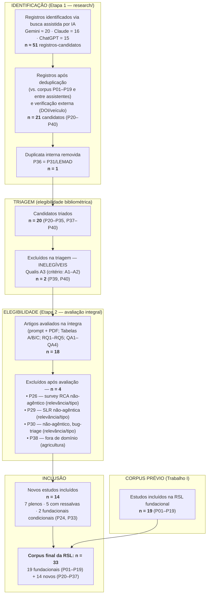
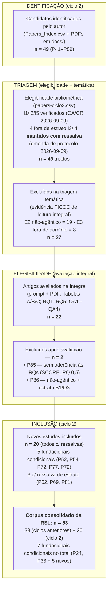

# Diagrama PRISMA — Seleção de Estudos da RSL

> 🧭 **Navegação:** [🏠 README raiz](../README.md) · [📊 Dashboard](DASHBOARD.md) · [📚 Pareceres](README.md) · [🔎 Descoberta](../research/README.md) · [🧩 PICOC](../picoc/picoc-comparacao-avaliadores.md)

Fluxo de seleção da RSL **"Agentic AI Copilot para Resposta a Incidentes"** no formato **PRISMA 2020** (adaptado para atualização de revisão: o corpus fundacional P01–P19 do Trabalho I entra como _estudos da revisão anterior_). Contagens auditáveis nos artefatos do repositório ([`research/`](../research/), [`reviews/`](README.md), [`Artigos-TrabalhoII.csv`](../Artigos-TrabalhoII.csv)).

## Diagrama

## Critérios de elegibilidade

### Critérios de inclusão (todos obrigatórios)

| #   | Critério                                                                                  | Verificação                                                                  |
| --- | ----------------------------------------------------------------------------------------- | ---------------------------------------------------------------------------- |
| I1  | Ano de publicação ∈ [2020, 2026]                                                          | [`papers.csv`](../papers.csv) (coluna Year)                                  |
| I2  | Veículo identificável e revisado por pares (journal/conference)                           | [`papers.csv`](../papers.csv) (Venue, ISSN, DOI)                             |
| I3  | Qualis ∈ {A1, A2} (2025-2028)                                                             | [`papers.csv`](../papers.csv) — verificação externa concluída                |
| I4  | SJR ∈ {Q1, Q2}                                                                            | [`papers.csv`](../papers.csv) — verificação externa concluída                |
| I5  | Citações ≥ 1, com `RECENCY_EXCEPTION` para publicações < 12 meses                         | [`papers.csv`](../papers.csv) (colunas de citações OpenAlex/Crossref/Scopus) |
| I6  | Aderência temática: abordagem **agêntica** × **domínio IR/AIOps/SOC** (eixo da avaliação) | Pareceres [`review-Pxx.md`](README.md) (RQ1–RQ5)                             |

### Critérios de exclusão (qualquer um)

| #   | Critério                                                 | Aplicado a                       |
| --- | -------------------------------------------------------- | -------------------------------- |
| E1  | Qualis A3 ou inferior (inelegível na triagem)            | P39, P40                         |
| E2  | Abordagem não-agêntica (survey/pipeline sem agência)     | P26, P29, P30                    |
| E3  | Fora do domínio de resposta a incidentes/operações de TI | P38                              |
| E4  | Duplicata (interna ou do corpus prévio)                  | P36 (= P31/LEMAD)                |
| E5  | Não revisado por pares (preprint sem aceite)             | aplicado na Etapa 1 (descoberta) |

### Notas metodológicas

- **Estudos secundários (P24, P33):** incluídos como **fundacionais condicionais** — permanecem no corpus para fundamentação (RQ1/RQ4/RQ5); se o protocolo restringir a estudos primários, migram para a fundamentação e o corpus primário novo fica com **12** estudos.
- **Identificação assistida por IA:** os ≈51 registros brutos são a saída dos três assistentes ([`research/`](../research/README.md)), com campos não confirmáveis marcados `UNVERIFIED` (antifabricação); a verificação externa de Qualis/SJR foi concluída posteriormente em [`papers.csv`](../papers.csv).
- **Validação cruzada da seleção:** a triagem/avaliação teve comparação entre avaliadores (Claude × ChatGPT: concordância 90%, κ = 0,74 — [`comparacao-avaliadores.md`](comparacao-avaliadores.md)); a extração PICOC teve três avaliadores ([`picoc/`](../picoc/picoc-comparacao-avaliadores.md)).

## Ciclo 2 (concluído em 2026-09-10)

Este diagrama acima registra o **ciclo 1** e não é reescrito. O fluxo do **ciclo 2** (candidatos P41–P89), concluído com a avaliação integral, é o seguinte:

Detalhes e evidências: [`triagem-ciclo2.md`](triagem-ciclo2.md) (triagem, emenda de protocolo, precedentes E2/E3), [`resultados-consolidados-ciclo2.csv`](resultados-consolidados-ciclo2.csv) (escores por estudo), [`graficos-ciclo2.md`](graficos-ciclo2.md) e a tabela-síntese em [`README.md`](README.md).

_Contagens do ciclo 2: 49 identificados → 49 triados (emenda: 4 mantidos c/ ressalva de estrato) → 27 excluídos na triagem (E2 = 19 · E3 = 8) → 22 avaliados → 20 incluídos (−2 excluídos) → **corpus consolidado 53**. Se o protocolo restringir o corpus a estudos primários, os 7 fundacionais condicionais migram para a fundamentação._

---

_Formato PRISMA 2020 adaptado para atualização de revisão. Contagens: ≈51 identificados → 21 candidatos → 20 triados (−1 duplicata) → 18 avaliados (−2 inelegíveis A3) → 14 incluídos (−4 excluídos) → corpus final 33 (19 + 14)._
