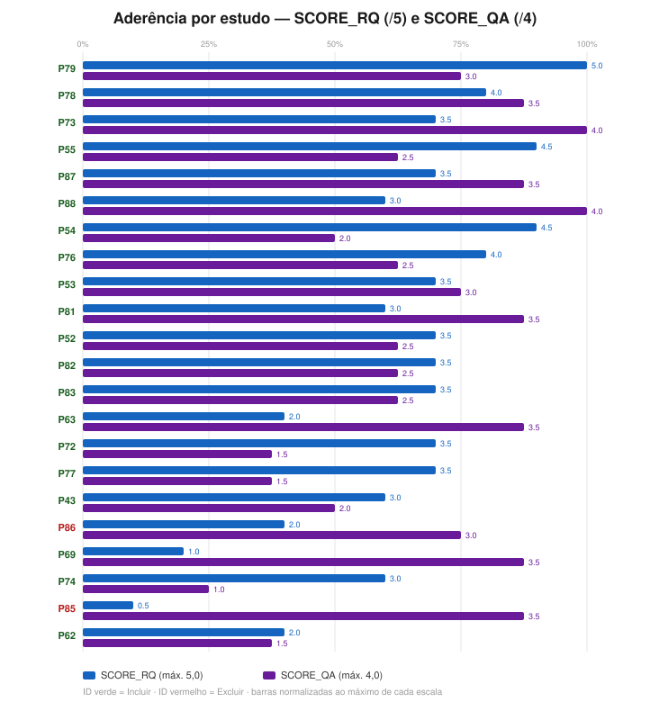
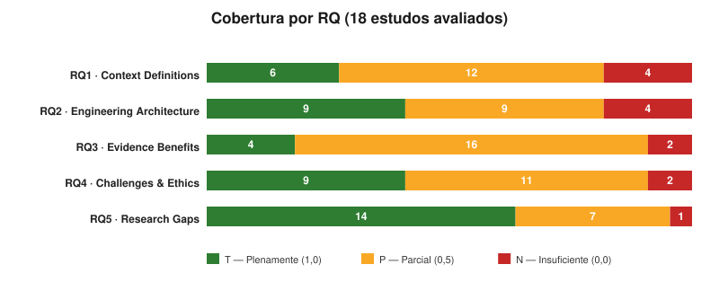
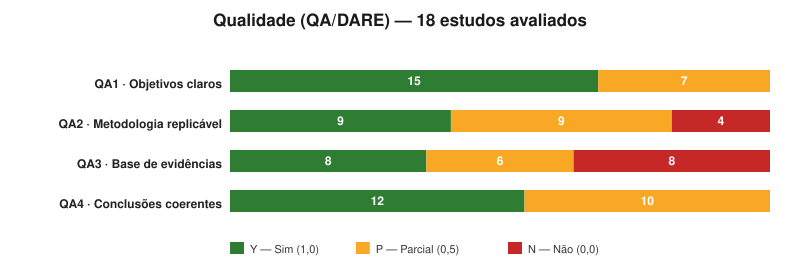
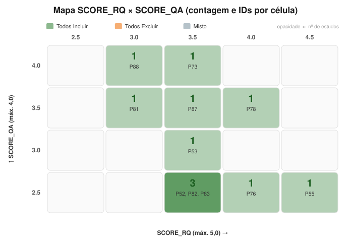
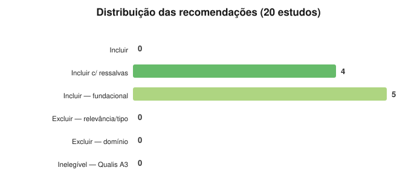

# Gráficos — Resultados do Ciclo 2 (P41–P89)

> 🧭 [📊 Dashboard](DASHBOARD.md) · [📈 Gráficos do ciclo 1](graficos.md) · [🛠️ Como criar os gráficos](COMO-CRIAR-GRAFICOS.md) · [🏠 README raiz](../README.md)

Visualizações geradas a partir de [`resultados-consolidados-ciclo2.csv`](resultados-consolidados-ciclo2.csv) (22 estudos avaliados na íntegra no ciclo 2; os 27 excluídos na triagem não entram — ver [`triagem-ciclo2.md`](triagem-ciclo2.md)). Geradas com o mesmo `scripts/gen_charts.py` do ciclo 1, apontado para o CSV do ciclo 2 (saída em `charts-ciclo2/`).

> Verde = Plenamente/Sim (T/Y) · Âmbar = Parcial (P) · Vermelho = Insuficiente/Não (N/N).

---

## 1. Aderência por estudo (SCORE_RQ e SCORE_QA)

Destaques: **P79** (RQ 5,0 — survey fundacional de SOC) e **P73/P88** (QA 4,0). Os dois excluídos (P85, P86) aparecem no extremo de baixa aderência às RQs.

---

## 2. Cobertura por questão de pesquisa (RQ)

O padrão do ciclo 1 se repete e se acentua: **RQ3 (Evidence Benefits) é a maior lacuna** — nenhum T pleno fora de P73/P79/P81/P88; o lote é rico em contribuição conceitual (RQ1/RQ2/RQ5) e pobre em evidência empírica de benefício.

---

## 3. Avaliação de qualidade (QA/DARE)

QA3 (Base de Evidências) concentra os N — os 8 estudos secundários/conceituais não têm validação empírica própria.

---

## 4. Grade RQ × QA por estudo

---

## 5. Recomendações

**20 Incluir c/ ressalvas · 2 Excluir** (P85 sem aderência às RQs; P86 não-agêntico + estrato B1/Q3). Nenhum "Incluir" pleno — reflexo do perfil conceitual/fundacional do lote.

