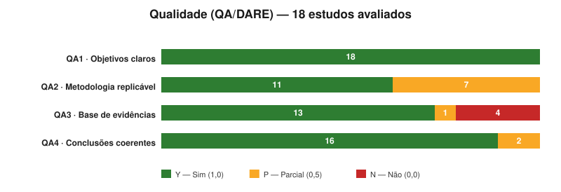

# Relatório de Síntese — RSL "Agentic AI Copilot para Resposta a Incidentes"

**Lote avaliado:** estudos candidatos **P20–P40** (20 estudos; P36 era duplicata de P31/LEMAD, removida).
**Fonte:** [`resultados-consolidados.csv`](resultados-consolidados.csv) + pareceres individuais [`review-Pxx.md`](.).
**Método de avaliação:** prompt por estudo (`../prompts/`) executado contra o PDF (`../docs/`), seguindo Kitchenham et al. (2009) e a lógica DARE (QA1–QA4). Vereditos de RQ em T/P/N (1,0 / 0,5 / 0,0) e QA em Y/P/N.

> ⚠️ **Ressalva transversal:** Citações, SJR e Qualis **não são verificáveis nos PDFs**. Todos os valores de Qualis/SJR vêm dos **insumos** do CSV e permanecem **pendentes de verificação externa** (Scimago; Plataforma Sucupira/Qualis CAPES; base indexadora).

---

## 1. Resumo executivo

- **20 estudos** processados; **18 avaliados integralmente**; **2 inelegíveis** na triagem (P39, P40 — **Qualis A3 < A1–A2**).
- **Aderência geral alta:** SCORE_RQ médio **3,83/5,0** (mediana 4,0); SCORE_QA médio **3,50/4,0** (mediana 3,75). **14 de 18** em **Banda Alta**, 4 em Média, nenhum em Baixa.
- **Decisão de inclusão:** **14 Incluir** (7 plenos + 5 com ressalvas + 2 fundacionais), **4 Excluir** por relevância/tipo/domínio, **2 Inelegíveis**.
- **Eixo organizador das decisões:** _agêntico × domínio-IR_. Incluídos são **agênticos e** próximos de IR/AIOps/SOC; exclusões recaem em não-agênticos, off-domain ou inelegíveis.
- **Lacuna sistemática identificada:** **RQ4 (Desafios & Ética)** é a questão menos coberta — apenas **4/18** plenamente respondidas; **14/18 parciais**. Ética/governança é o ponto fraco recorrente dos estudos técnicos de sistema.

---

## 2. Funil de elegibilidade (ETAPA 1)

| Etapa                                   | Qtde | IDs                             |
| --------------------------------------- | :--: | ------------------------------- |
| Candidatos recebidos                    |  20  | P20–P40 (P36 já removido)       |
| **Inelegíveis (Qualis A3)**             |  2   | P39, P40                        |
| **Elegíveis (avaliados)**               |  18  | demais                          |
| → Incluídos (qualquer forma)            |  14  | P20–P25, P27, P28, P31–P35, P37 |
| → Excluídos por relevância/tipo/domínio |  4   | P26, P29, P30, P38              |

**Critérios verificáveis no PDF** (Ano ≥ 2020; veículo ≠ NULL) **atendidos por todos**. Os critérios **Citações ≥ 1, SJR Q1–Q2 e Qualis A1–A2** ficam **pendentes** — exceto Qualis A3 de P39/P40 (insumo), que motiva a inelegibilidade.

---

## 3. Cobertura por questão de pesquisa (RQ)

Distribuição de vereditos entre os **18 estudos avaliados**:

| RQ      | Tema                                                                            | T (1,0) | P (0,5) | N (0,0) | Leitura                                                   |
| ------- | ------------------------------------------------------------------------------- | :-----: | :-----: | :-----: | --------------------------------------------------------- |
| **RQ1** | Context Definitions (autonomia, planejamento, memória, ferramentas, supervisão) |    9    |    6    |    3    | Boa, mas heterogênea: 3 estudos sem conteúdo agêntico (N) |
| **RQ2** | Engineering Architecture (orquestração, memória, guardrails, observabilidade)   |   11    |    6    |    1    | **Forte** — núcleo dos estudos de sistema                 |
| **RQ3** | Evidence Benefits (métricas, tempo de resposta, qualidade de decisão)           |   12    |    6    |    0    | **Mais coberta** — evidência empírica abundante           |
| **RQ4** | Challenges & Ethics (segurança, robustez, governança, accountability)           |  **4**  | **14**  |    0    | **Lacuna sistemática** — ética/governança rasa            |
| **RQ5** | Research Gaps (avaliação, threat models, governança, observabilidade)           |   16    |    2    |    0    | **Quase universal** — direções futuras bem articuladas    |

**Achados-chave:**

- **RQ3 e RQ5 são os pontos fortes** do corpus: os estudos reportam métricas (F1, MTTD/MTTR, latência, acurácia de localização) e propõem direções futuras de forma consistente.
- **RQ4 é o gargalo.** Apenas **P24, P33, P34, P37** respondem RQ4 plenamente — justamente os estudos **conceituais/governança/humano-organizacionais**. Os **sistemas agênticos técnicos** (P21–P23, P25, P27, P28, P31, P32, P35) recebem majoritariamente **P** por discutirem desafios técnicos mas **omitirem ética/governança/accountability** — notável dado que vários atuam em **infraestrutura crítica** (rede elétrica: P31, P32, P35) ou têm **caráter dual-use** (P25 ofensivo).
- **RQ1 (N=3):** os três sem conteúdo agêntico são **P26** (survey de RCA), **P29** (SLR) e **P30** (pipeline LLM) — coerente com suas exclusões.

---

## 4. Avaliação de qualidade (QA / DARE)

| Critério                          |  Y  |  P  |   N   | Observação                                                                                                |
| --------------------------------- | :-: | :-: | :---: | --------------------------------------------------------------------------------------------------------- |
| **QA1** Objetivos claros          | 18  |  0  |   0   | Universal — todos enunciam problema/objetivos                                                             |
| **QA2** Metodologia replicável    | 11  |  7  |   0   | 7 parciais: dados proprietários / sem código / prompts não publicados (P20, P26, P28, P29, P31, P32, P33) |
| **QA3** Base de evidências sólida | 13  |  1  | **4** | **4 N = estudos secundários** sem validação empírica própria (P24, P26, P29, P33)                         |
| **QA4** Conclusões coerentes      | 16  |  2  |   0   | 2 parciais (P23, P26): limitações pouco discutidas                                                        |

- **Banda de qualidade:** **14 Alta** (≥3,0) · **4 Média** (1,5–2,5) · **0 Baixa**. As 4 Médias são **P24, P26, P29, P33** — todos **secundários** (QA3 = N puxa o escore).
- **Reprodutibilidade (QA2)** é o calcanhar recorrente dos estudos primários: **dados de produção proprietários** (SGCC em P31/P32/P35; SpamAssassin/custom em P28) e **ausência de repositórios de código/prompts** limitam a replicação plena. Exceções positivas: P35 (templates de prompt no apêndice), P38 (base pública + métricas definidas), P34/P37 (protocolos detalhados).

---

## 5. Ranking de aderência (SCORE_RQ + SCORE_QA)

| Pos. | ID      | SCORE_RQ | SCORE_QA |  Σ  | Recomendação                 |
| :--: | ------- | :------: | :------: | :-: | ---------------------------- |
|  1   | **P21** |   4,5    |   4,0    | 8,5 | Incluir                      |
|  1   | **P22** |   4,5    |   4,0    | 8,5 | Incluir                      |
|  1   | **P25** |   4,5    |   4,0    | 8,5 | Incluir                      |
|  1   | **P27** |   4,5    |   4,0    | 8,5 | Incluir                      |
|  5   | **P28** |   4,5    |   3,5    | 8,0 | Incluir                      |
|  5   | **P31** |   4,5    |   3,5    | 8,0 | Incluir                      |
|  5   | **P34** |   4,0    |   4,0    | 8,0 | Incluir c/ ressalvas         |
|  5   | **P35** |   4,0    |   4,0    | 8,0 | Incluir                      |
|  9   | P32     |   4,0    |   3,5    | 7,5 | Incluir c/ ressalvas         |
|  9   | _P38_   |   3,5    |   4,0    | 7,5 | _Excluir (domínio)_          |
|  11  | P20     |   4,0    |   3,0    | 7,0 | Incluir c/ ressalvas         |
|  11  | P23     |   3,5    |   3,5    | 7,0 | Incluir c/ ressalvas         |
|  11  | _P30_   |   3,0    |   4,0    | 7,0 | _Excluir (tipo)_             |
|  11  | P37     |   3,0    |   4,0    | 7,0 | Incluir c/ ressalvas         |
|  15  | P24     |   4,0    |   2,5    | 6,5 | Incluir c/ ressalvas (fund.) |
|  15  | P33     |   4,0    |   2,5    | 6,5 | Incluir c/ ressalvas (fund.) |
|  17  | _P26_   |   2,5    |   2,5    | 5,0 | _Excluir_                    |
|  17  | _P29_   |   2,5    |   2,5    | 5,0 | _Excluir_                    |

> Nota: a pontuação **não substitui** a decisão de relevância. P38 e P30 pontuam alto (Σ 7,5 e 7,0) mas são **excluídos** por domínio/tipo — escore alto ≠ aderência ao escopo da RSL.

**Núcleo recomendado (top tier):** **P21, P22, P25, P27, P28, P31, P35** — sistemas agênticos, IR/AIOps/SOC, evidência empírica robusta. **P34** complementa pelo lado _copilot/IR puro_ (NIST 800-61).

O mapa abaixo cruza os dois escores: o quadrante superior-direito (SCORE_RQ ≥ 4,0 e SCORE_QA ≥ 3,5) concentra o núcleo de inclusão; exclusões por tipo/domínio (P30, P38) aparecem com alta qualidade mas fora do escopo, e os secundários (P24, P33, P26, P29) caem na faixa de QA ≤ 2,5.

---

## 6. Taxonomia do corpus incluído

**Por paradigma de agente** (eixo a registrar no mapeamento, pois afeta comparabilidade):

| Paradigma                                            | Estudos            |
| ---------------------------------------------------- | ------------------ |
| **LLM multi-agente** (orquestrador + especializados) | P27, P28, P31, P35 |
| **LLM-agente closed-loop** (sense→act autônomo)      | P22                |
| **SLM-agente** (modelos pequenos, on-prem)           | P21                |
| **LLM + GNN / tools** (agente sobre núcleo DL)       | P23, P32           |
| **LLM+RAG multiagente**                              | P20                |
| **MAS/RL não-LLM** (RL/ML, IR baseado em regras)     | P25                |
| **LLM copilot / baixa autonomia**                    | P34                |
| **Survey de percepção** (lado da demanda)            | P37                |
| **Survey/Review agêntico** (fundacional)             | P24, P33           |

**Por domínio:** RCA/diagnóstico (P23, P27, P32, P35) · AIOps/operações (P21, P31) · SOC/detecção & IR de segurança (P25, P28, P34, P37) · remediação (P22) · prevenção IaC (P20) · fundamentação (P24, P33).

**Espectro de autonomia** (útil para a discussão): **remediação autônoma closed-loop (P22)** → **multi-agente RCA com validação adversarial (P27/P35)** → **GNN+agente de recuperação offline (P32)** → **copilot humano-no-loop (P34)** → **percepção de adoção/confiança (P37)**.

---

## 7. Achados transversais e implicações para a RSL

1. **A maturidade está na arquitetura e na evidência (RQ2/RQ3), não na governança (RQ4).** O campo entrega sistemas agênticos funcionais e bem medidos, mas **subtrata ética, accountability e governança** — gap a destacar como contribuição/lacuna da RSL, sobretudo para infraestrutura crítica e usos dual-use.
2. **Convergência forte em RCA/AIOps.** Metade dos incluídos ataca **localização de causa raiz** (P23, P27, P32, P35) — sinal de sub-tarefa madura do IR; a **remediação autônoma** (P22) e a **detecção/correlação em SOC** (P28) são menos povoadas, indicando frente promissora.
3. **Dois paradigmas concorrentes de "agente":** LLM-agêntico (maioria) vs **MAS/RL não-LLM** (P25) — comparáveis em desempenho de IR, mas distintos em autonomia/explicabilidade; e o extremo **copilot** (P34) alinhado ao próprio título da RSL.
4. **Procedência concentrada:** P31, P32, P35 vêm de equipes ligadas à **State Grid (China)** — registrar ao analisar independência/viés do corpus.
5. **Risco temporal de elegibilidade:** **5 estudos de 2026** (P25, P30, P32, P35, P37) podem ter **0 citações** — o critério "Citações ≥ 1" deve ser verificado antes de confirmar inclusão (pode reclassificar P30/P32/P35/P37).

---

## 8. Decisões de exclusão (rastreabilidade)

| ID      | Motivo                                                                       | Natureza                 |
| ------- | ---------------------------------------------------------------------------- | ------------------------ |
| P26     | Secundário (survey de RCA) **e** não-agêntico (RQ1=N)                        | Relevância/tipo          |
| P29     | Secundário (SLR) **e** não-agêntico (RQ1=N)                                  | Relevância/tipo          |
| P30     | Não-agêntico (pipeline LLM; RQ1=N) + domínio bug-triage de inference engines | Relevância/tipo          |
| P38     | Agêntico, alta qualidade, mas **domínio agricultura** (0 menções a IR)       | Domínio                  |
| **P39** | **Qualis A3** (< A1–A2) + artigo de opinião (não-empírico)                   | **Inelegível (ETAPA 1)** |
| **P40** | **Qualis A3** (< A1–A2) + survey secundário não-agêntico                     | **Inelegível (ETAPA 1)** |

_Estudos fundacionais (P24, P33):_ incluídos **com ressalva** — se o protocolo restringir o corpus primário a **estudos primários**, migram para a **fundamentação**, resultando em **12 estudos no corpus primário**.

---

## 9. Confiabilidade entre avaliadores (Claude × ChatGPT)

Os 20 estudos foram avaliados **independentemente** por dois avaliadores (Claude e ChatGPT) sob o mesmo protocolo. A concordância é **substancial**, o que reforça a robustez dos vereditos:

- **Decisão (Incluir/Excluir): 90%** (18/20) · **Cohen's κ = 0,74**.
- **Banda de qualidade: 100%** (18/18) · erro absoluto médio **SCORE_RQ 0,42 / SCORE_QA 0,31**.
- **RQ4 e RQ5: 100% de acordo** — ambos os avaliadores confirmam, de forma independente, a **lacuna sistemática de ética/governança (RQ4)**, tornando esse achado avaliador-robusto.
- Únicas 2 divergências de decisão: **P26 e P29** (surveys/SLR não-agênticos) — o ChatGPT inclui com ressalvas; o Claude exclui. Reforça que o único ponto de protocolo em aberto é o **tratamento de estudos secundários**.

> Detalhes e tabela lado a lado: **[comparacao-avaliadores.md](comparacao-avaliadores.md)** · dados em [`comparacao-avaliadores.csv`](comparacao-avaliadores.csv).

---

## 10. Citações cruzadas no corpus (P01–P40)

Levantamento de **quem cita quem dentro do corpus de 39 artigos** (fundacionais P01–P19 + candidatos P20–P40), com tripla checagem em **OpenAlex, Crossref e Scopus** (verificado em 2026-07-27): **26 pares** citador→citado na União (OpenAlex 20 · Crossref 21 · Scopus 25).

| Mais citados no corpus                             | Citações (União) | Citado nos artigos                                              |
| -------------------------------------------------- | :--------------: | --------------------------------------------------------------- |
| **P10** — Agentic AI: Autonomous Intelligence      |      **7**       | P01, P03, P06, P09, P15, P24, P33                               |
| **P14** — Transforming Cybersecurity w/ Agentic AI |      **5**       | P03, P06, P15, P28, P37                                         |
| **P09** — AI Agents vs. Agentic AI                 |      **4**       | P03, P06, P15, P33 (via DOI de preprint; só Scopus/S2 resolvem) |
| P02 · P13 · P16                                    |      2 cada      | —                                                               |
| P12 · P24 · P31 · P39                              |      1 cada      | —                                                               |

**Leituras para a síntese:**

- **A espinha dorsal conceitual do corpus são os surveys fundacionais** (P10, P14, P09) — os candidatos avaliados os citam como referência de definição de Agentic AI, confirmando a coerência entre a base do Trabalho I e os novos estudos.
- **Os 14 estudos incluídos (2025–2026) ainda não citam uns aos outros** — a frente de pesquisa é jovem e fragmentada; a consolidação cruzada entre os primários deverá aparecer nos próximos ciclos de citação.
- **Independência dos estudos State Grid** (P31, P32, P35 — observação da Seção 7): nas três fontes, apenas **P38→P31** aparece como citação interna envolvendo esse grupo; não há citação mútua entre P31/P32/P35, o que reduz (mas não elimina) a preocupação de dependência.

> Matriz completa, arestas e notas metodológicas (o `REF()` do Scopus casa por título, não por DOI; caso do P09 citado via DOI de preprint): **[citacoes-cruzadas.md](../citacoes-cruzadas.md)** · citações externas totais em [`papers.csv`](../papers.csv).

---

## 11. Limitações desta avaliação

- **Extração de texto via PDFKit** (sem renderização de página): tabelas/figuras com layout complexo podem ter perdido valores tabulares — vereditos ancorados no texto corrido e nas tabelas legíveis.
- **Qualis/SJR/Citações não confirmados** (insumos): toda decisão de elegibilidade dependente desses itens é **provisória**.
- **Julgamento de relevância** (agêntico × IR) é interpretativo; casos-limite (P30, P34, P37, P38) foram explicitados nos pareceres individuais para auditabilidade.

---

## 12. Próximos passos recomendados

1. **Verificar externamente** Citações/SJR/Qualis dos 18 elegíveis (atenção a P30/P32/P35/P37 — 2026, possível 0 citações; e confirmar A3 de P39/P40).
2. **Decidir no protocolo** o tratamento de estudos secundários (P24, P33): corpus primário vs fundamentação.
3. **Anexar os escores** às Tabelas 3, 5 e 7 da RSL existente (IDs já sequenciais a partir de P20).
4. **Destacar a lacuna de RQ4** (ética/governança) como achado/contribuição da revisão.
5. **Registrar o eixo de paradigma de agente** (Seção 6) no mapeamento, para comparabilidade entre LLM-agêntico, MAS/RL e copilot.

---

## 13. Nota metodológica (métodos e métricas)

Esta seção descreve, de forma reprodutível, **como** os números deste relatório e da [comparação entre avaliadores](comparacao-avaliadores.md) foram obtidos.

### 13.1 Protocolo de avaliação (Kitchenham + DARE)

Cada estudo foi avaliado seguindo as diretrizes de **Kitchenham et al. (2009)** para RSL em Engenharia de Software, com a avaliação de qualidade espelhando a lógica dos critérios **DARE (QA1–QA4)**. O fluxo por estudo: triagem de elegibilidade (PRISMA/ETAPA 1) → classificação das 5 RQs → avaliação de qualidade (4 QAs) → parecer (Incluir / Incluir com ressalvas / Excluir).

### 13.2 Pontuação das RQs (SCORE_RQ)

Cada RQ recebe um veredito ancorado em evidência do PDF, convertido em escore:

| Símbolo | Veredito                                                             | Valor |
| :-----: | -------------------------------------------------------------------- | :---: |
|  **T**  | Respondida Plenamente (todas as subdimensões com conteúdo explícito) |  1,0  |
|  **P**  | Parcialmente Respondida (≥1 subdimensão, ou cobertura genérica)      |  0,5  |
|  **N**  | Sem conteúdo suficiente (ausente ou apenas tangencial)               |  0,0  |

**SCORE_RQ** = soma dos 5 vereditos (**máximo 5,0**).

### 13.3 Avaliação de qualidade (SCORE_QA e banda)

Quatro critérios DARE — QA1 (objetivos claros), QA2 (metodologia replicável), QA3 (base de evidências sólida; _toy example_ = P, teórico = N), QA4 (conclusões coerentes) — pontuados **Y = 1,0 / P = 0,5 / N = 0,0**.

**SCORE_QA** = soma (**máximo 4,0**). **Banda de qualidade:** Alta ≥ 3,0 · Média 1,5–2,5 · Baixa < 1,5.

### 13.4 Triagem de elegibilidade (ETAPA 1 / PRISMA)

Critérios de inclusão: Ano ≥ 2020; veículo identificável; **Citações ≥ 1**; **SJR Q1–Q2**; **Qualis A1–A2**. Os três últimos não são verificáveis no PDF → marcados `[VERIFICAR]`. Estudos com Qualis A3 informado (P39, P40) foram tratados como **inelegíveis** (encerramento na triagem).

### 13.5 Estatística descritiva

- **Média / mediana** de SCORE_RQ e SCORE_QA sobre os 18 estudos avaliados (P39/P40 excluídos por serem `NA`).
- Distribuição de bandas e de vereditos T/P/N por RQ (contagens simples).

### 13.6 Concordância entre avaliadores

Compara os vereditos **independentes** de dois avaliadores (Claude e ChatGPT) sobre o mesmo protocolo. Métricas:

**(a) Acordo observado (P₀)** — proporção de estudos em que os dois concordam:

`P₀ = (nº de concordâncias) ÷ N`

Aqui, decisão Incluir/Excluir: P₀ = 18/20 = **0,90** (90%).

**(b) Cohen's κ (kappa)** — corrige o acordo observado pelo **acordo esperado ao acaso (Pₑ)**, dado o quanto cada avaliador usa cada categoria. É a medida-padrão de _inter-rater reliability_ para classificações categóricas:

`κ = (P₀ − Pₑ) / (1 − Pₑ)` , com `Pₑ = Σᵢ (n_Claude,i × n_ChatGPT,i) / N²`

_Por que usar κ e não só o % de acordo?_ Porque dois avaliadores que dão "Incluir" com frequência concordariam bastante **por acaso**; κ desconta esse acaso. κ = 1 é acordo perfeito; κ = 0 é igual ao acaso; κ < 0 é pior que o acaso.

**Cálculo neste lote** (decisão binária, N = 20):

- Marginais: Claude → 14 Incluir / 6 Excluir; ChatGPT → 16 Incluir / 4 Excluir.
- Acordo esperado: `Pₑ = (14×16 + 6×4) / 20² = 248 / 400 = 0,62`.
- `κ = (0,90 − 0,62) / (1 − 0,62) = 0,28 / 0,38 = ` **0,737**.

**Interpretação (escala de Landis & Koch, 1977):**

| κ             | Força da concordância                  |
| ------------- | -------------------------------------- |
| < 0,00        | Pobre (pior que o acaso)               |
| 0,00–0,20     | Leve                                   |
| 0,21–0,40     | Razoável                               |
| 0,41–0,60     | Moderada                               |
| **0,61–0,80** | **Substancial** ← κ = 0,74 (este lote) |
| 0,81–1,00     | Quase perfeita                         |

**(c) Erro absoluto médio (MAE) dos escores** — magnitude típica da diferença numérica entre avaliadores:

`MAE = (1/n) · Σ |SCORE_ChatGPT − SCORE_Claude|`

Resultados: MAE(SCORE_RQ) = **0,42**; MAE(SCORE_QA) = **0,31** (n = 18; P39/P40 excluídos por `NA`).

**(d) Acordo exato por RQ** — proporção de estudos em que o símbolo T/P/N coincide, por RQ (RQ1 67% … RQ4/RQ5 100%).

> **Limitações da comparação:** N = 20 é pequeno (κ tem variância alta nesse tamanho); a decisão é reduzida a binária (Incluir/Excluir) para o κ, ignorando a gradação "com ressalvas"; os escores do ChatGPT foram **extraídos automaticamente** de seus pareceres (`gen_comparison.py`), sujeitos a variação de formato. Ainda assim, a convergência (90% / κ 0,74 / banda 100% / RQ4–RQ5 100%) é consistente e interpretável.

### 13.7 Extração de dados e reprodutibilidade

Texto dos PDFs extraído via **PDFKit** (não houve renderização de página). Escores consolidados em [`resultados-consolidados.csv`](resultados-consolidados.csv); comparação gerada por [`scripts/gen_comparison.py`](scripts/gen_comparison.py); gráficos por [`scripts/gen_charts.py`](scripts/gen_charts.py); este relatório em PDF por [`scripts/build_pdf.py`](scripts/build_pdf.py).

> **Referências.** Kitchenham, B. et al. (2009). _Systematic literature reviews in software engineering – A systematic literature review._ Information and Software Technology. · Cohen, J. (1960). _A coefficient of agreement for nominal scales._ Educational and Psychological Measurement. · Landis, J.R. & Koch, G.G. (1977). _The measurement of observer agreement for categorical data._ Biometrics.

---

_Gerado a partir de `reviews/resultados-consolidados.csv` (20 estudos). Estatísticas: SCORE_RQ médio 3,83; SCORE_QA médio 3,50; 14 Banda Alta; RQ4 plenamente respondida em apenas 4/18. Concordância entre avaliadores: decisão 90%, Cohen's κ = 0,74 (substancial)._
