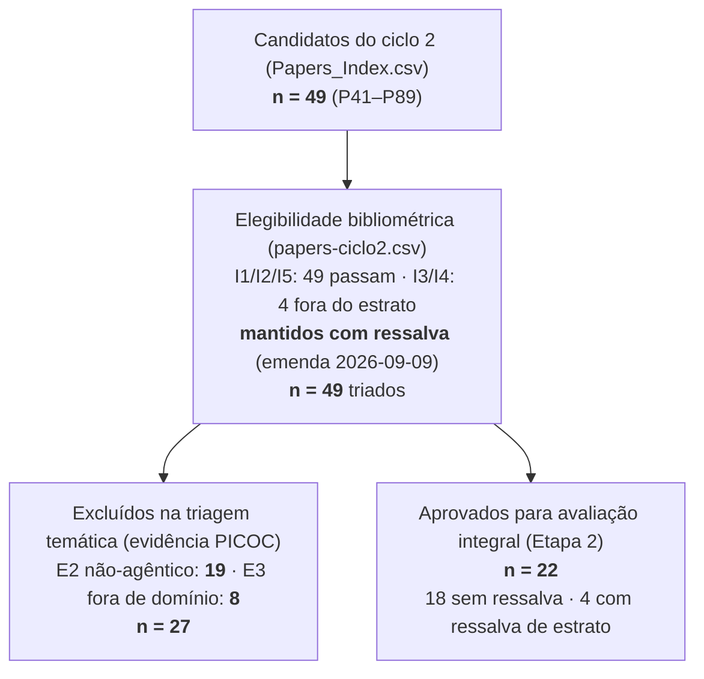

# Triagem PRISMA — Ciclo 2 (P41–P89)

> 🧭 **Navegação:** [🏠 README raiz](../README.md) · [🧾 PRISMA ciclo 1](PRISMA.md) · [🧮 Elegibilidade](../papers-ciclo2.csv) · [🧩 PICOC ciclo 2](../picoc/picoc-results-consolidated-P41-P89-Claude.md) · [📚 Pareceres ciclo 1](README.md)

Triagem dos **49 candidatos do ciclo 2** (P41–P89, [`Papers_Index.csv`](../Papers_Index.csv)) pelos critérios **I1–I6 / E1–E5** do [`PRISMA.md`](PRISMA.md), executada em **2026-09-09**. Diferente do ciclo 1 (triagem por título/insumos), esta triagem usa como base de evidência a **extração PICOC de leitura integral** ([`picoc-results-consolidated-P41-P89-Claude.md`](../picoc/picoc-results-consolidated-P41-P89-Claude.md)) — cada exclusão é ancorada no conteúdo lido, não apenas no título.

## ⚖️ Emenda de protocolo (2026-09-09)

Por decisão do autor, **os critérios I3 (Qualis A1–A2) e I4 (SJR Q1–Q2) não excluem nesta triagem**: os 4 candidatos fora dos estratos — **P62 e P69 (Qualis A3), P81 (A4), P86 (B1 + SJR Q3)** — são **mantidos com ressalva de estrato**, a registrar em qualquer parecer/inclusão futura. Os vereditos estritos permanecem documentados em [`papers-ciclo2.csv`](../papers-ciclo2.csv) (registro da regra original); esta emenda vale para o ciclo 2 até nova decisão.

Os demais critérios de elegibilidade foram verificados no passo 1 e **todos os 49 passam**: ano ≥ 2020 (I1), veículo identificável (I2), Citações ≥ 1 em OpenAlex e Crossref (I5, verificação 2026-09-09; Scopus pendente de chave).

## Fluxo da triagem

## ✅ Aprovados para avaliação integral — n = 22

| ID  | Estudo (resumo)                                   | Eixo de aderência                                | Flags para o parecer                                              |
| --- | ------------------------------------------------- | ------------------------------------------------ | ----------------------------------------------------------------- |
| P43 | Agentic AIOps framework                           | Agêntico × AIOps (núcleo)                        | Sem resultados experimentais (Seç. 5)                             |
| P52 | LLMs in Cybersecurity (SLR)                       | LLM × SOC (secundário)                           | Candidato a fundacional (análogo a P33)                           |
| P53 | LLM + Bayesian nets p/ RCA cloud-native           | LLM × RCA/IR                                     | Comparison N/A (contraste conceitual)                             |
| P54 | LLM Reasoning → Autonomous Agents (review)        | Agêntico (fundamentos)                           | Candidato a fundacional (análogo a P24)                           |
| P55 | Telemetry & Agentic AI (redes ópticas)            | Agêntico × automação de rede                     | Estudo de mapeamento                                              |
| P62 | Neuroergonomics: mental workload (review)         | Carga cognitiva (Outcome)                        | ⚠️ **Ressalva de estrato: Qualis A3** · fora do domínio TI        |
| P63 | Chatbot Usability Scale (BUS-15)                  | Avaliação de copilots (instrumento)              | Instrumento HCI, não sistema; domínio geral                       |
| P69 | WAUC: mental workload database                    | Carga cognitiva (Outcome)                        | ⚠️ **Ressalva de estrato: Qualis A3** · fora do domínio TI        |
| P72 | LLMs: Vulnerability → Defense (mapping)           | LLM × segurança (secundário)                     | Candidato a fundacional                                           |
| P73 | Alert fatigue: AI-assisted SIEM                   | IR/SOC × alert fatigue (Outcome nomeado)         | AI-assistido, agência limitada (componente ML)                    |
| P74 | MLOps → LLMOps (review)                           | LLMOps (tema prioritário da tese)                | Secundário; contraste conceitual                                  |
| P76 | SOC hyper-automation com Agentic AI               | Agêntico × SOC/SOAR (núcleo)                     | Único com MTTR citado (vs. literatura)                            |
| P77 | GenAI in cybersecurity (review)                   | GenAI/LLM × SOC (secundário)                     | Candidato a fundacional                                           |
| P78 | RAG + LLM p/ incident timeline                    | LLM × IR/forense                                 | Comparison N/A (conceitual)                                       |
| P79 | AI-Augmented SOC: LLMs & agents (survey)          | Agêntico × SOC (secundário)                      | Candidato a fundacional (análogo a P33)                           |
| P81 | Control room operator DSS                         | Apoio à decisão do operador × experimento humano | ⚠️ **Ressalva de estrato: Qualis A4** · domínio processos/energia |
| P82 | AI Agent predictive maintenance (framework)       | Agêntico (proposta conceitual)                   | Domínio manutenção industrial; sem evidência empírica             |
| P83 | Wazuh RAG copilot p/ SOC                          | Copilot × IR/SOC (núcleo)                        | Comparação restrita (2 LLMs vs. ground truth)                     |
| P85 | Fadiga de operadores VTS (termografia + cognição) | Carga cognitiva/fadiga em operação real          | Domínio marítimo (não-TI); operação real 24/7                     |
| P86 | Distributed tracing + rule induction              | Observabilidade × troubleshooting cloud-native   | ⚠️ **Ressalva de estrato: Qualis B1 + SJR Q3** · não-agêntico     |
| P87 | LLM agentic incident-report (rede/XAI)            | Agêntico × IR de rede (núcleo)                   | LLM/RAG sem ablation (future work)                                |
| P88 | Self-healing descentralizado (MAS)                | Agêntico não-LLM × remediação (análogo a P25)    | Simulação; domínio topologia de rede                              |

## ❌ Excluídos na triagem — n = 27

### E2 — abordagem não-agêntica (survey/método/pipeline sem agência) — n = 19

| ID  | Estudo (resumo)                                     | Evidência (PICOC)                           | Precedente ciclo 1   |
| --- | --------------------------------------------------- | ------------------------------------------- | -------------------- |
| P41 | DL p/ time-series anomaly detection (survey)        | Estudo de mapeamento; sem agência           | P29                  |
| P42 | Task failure prediction em cloud (DL)               | Método DL vs. baselines HSMM/SVM/RNN/LSTM   | P30                  |
| P44 | Edge-IIoTset (dataset de cibersegurança)            | Dataset + benchmark de classificadores      | P30                  |
| P45 | DL anomaly detection em séries (review + benchmark) | Benchmark de 9 modelos, sem agência         | P29                  |
| P46 | Benchmarking ML p/ IDS (CICIDS2017)                 | Benchmark de 31 modelos                     | P30                  |
| P47 | VAE p/ intrusion detection                          | Método (VAE vs. AE/OCSVM)                   | P30                  |
| P48 | DL não-supervisionado p/ tráfego de rede            | Método; comparação só qualitativa           | P30                  |
| P49 | RNN anomaly detection p/ IoT                        | Método (LSTM/BiLSTM/GRU/CNN)                | P30                  |
| P50 | Observability de microsserviços (survey)            | Estudo de mapeamento                        | P26                  |
| P51 | Cloud network anomaly detection (survey)            | Estudo de mapeamento                        | P29                  |
| P64 | ML/DL anomaly detection IoT (review)                | Estudo de mapeamento                        | P29                  |
| P65 | DL p/ log anomaly detection (survey)                | Survey + experimento de baselines simples   | P29 (análogo direto) |
| P66 | Zero-touch management 5G/6G (survey)                | Mapeamento de automação sem agência LLM/MAS | P26                  |
| P70 | OS log anomaly via sentiment analysis (DL)          | Método vs. baselines clássicos/DL           | P30                  |
| P71 | Threat intelligence e data breaches (review)        | Revisão narrativa, sem experimento          | P26                  |
| P75 | SIEM cloud: monitoramento proativo                  | Demonstração sem baseline (NÃO DECLARADO)   | P30                  |
| P80 | Imbalanced learning p/ alertas de segurança         | Método ML isolado (o framework fica em P73) | P30                  |
| P84 | Disponibilidade cloud via Bayesian networks         | Modelagem de confiabilidade, sem agência    | P30                  |
| P89 | Transformers colaborativos p/ logs de SO            | Método vs. 10 baselines                     | P30                  |

### E3 — fora do domínio de resposta a incidentes/operações de TI — n = 8

| ID  | Estudo (resumo)                              | Domínio real (evidência PICOC)        |
| --- | -------------------------------------------- | ------------------------------------- |
| P56 | Variational LSTM p/ anomalias industriais    | Big data industrial (manufatura)      |
| P57 | AI p/ predictive maintenance (review)        | Manutenção industrial                 |
| P58 | Industrial image anomaly detection (survey)  | Inspeção visual industrial (MVTec AD) |
| P59 | Anomaly detection com density estimation     | Física de partículas (LHC)            |
| P60 | Corrective → predictive maintenance (review) | Setor elétrico/industrial             |
| P61 | IoT + ML DSS p/ predictive maintenance       | Indústria 4.0 (manutenção)            |
| P67 | EADN: anomaly detection em vídeos            | Vídeo-vigilância                      |
| P68 | Big-data RCA em quality problem solving      | Qualidade de manufatura               |

## Notas metodológicas

- **Base de evidência:** cada decisão E2/E3 é ancorada na extração PICOC de leitura integral (Population/Intervention/Context + célula Comparison), não em título/abstract — mitigando o risco de exclusão indevida na triagem.
- **Precedentes do ciclo 1:** E2 segue os casos P26/P29/P30 (não-agênticos avaliados e excluídos) e E3 segue P38 (off-domain). No ciclo 1 essas exclusões ocorreram **após** avaliação integral; no ciclo 2, com 49 candidatos e leitura integral já realizada via PICOC, a exclusão antecipada na triagem é auditável pelos mesmos critérios.
- **Cluster de carga cognitiva (P62, P69, P81, P85):** aprovado para avaliação por tocar diretamente o Outcome `COGNITIVE_LOAD` da RSL — lacuna do ciclo 1 (nenhum estudo P01–P40 media carga cognitiva). Três dos quatro carregam ressalva de estrato (emenda acima); a avaliação integral deve decidir entre corpus primário, stream suplementar (cf. `research/prompt.md`, SUPPLEMENTARY) ou fundamentação.
- **Candidatos a fundacionais (P52, P54, P72, P77, P79):** estudos secundários sobre LLM/agentes em segurança/operações — mesmo tratamento condicional de P24/P33 no ciclo 1.
- **Sequência:** os 22 aprovados seguem para a **Etapa 2** (template [`../prompts/prompt-chatgpt-consultation.md`](../prompts/prompt-chatgpt-consultation.md) → `prompts/prompt-PNN.md` → `reviews/review-PNN.md`), com as flags desta tabela transcritas nos INSUMOS/pareceres.

---

_Triagem do ciclo 2 executada em 2026-09-09 sobre Papers_Index.csv + papers-ciclo2.csv + PICOC P41–P89. Contagens: 49 candidatos → 49 triados (emenda de estrato: 4 mantidos com ressalva) → 27 excluídos (E2 = 19 · E3 = 8) → **22 aprovados para avaliação integral**._
